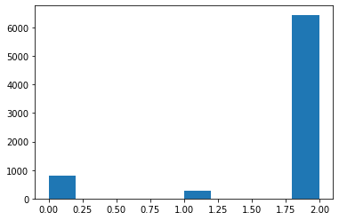

# 数据科学导论报告

> 黄科鑫 PB19061283

### 任务介绍

在比赛*产品评论观点提取* 中，有两个任务，其中一个是**评论的情感识别**任务，即实现：

​	 **(input) 评论文本 ----> (output) 情感类别**（包含正面、负面和中立）的任务。

比赛要求分类结果使用**Kappa Score**进行计算。

注：本次实验是在比赛已经结束的状态下进行的，不能使用平台的评测功能，本地实验时是将公开训练样例按8:1:1分割为训练、验证和测试集进行训练和测试的。

### 初步分析

拿到数据，首先要检查一下其特征

- 文本特征：一共`7528`条评论，经过结巴分词后，得到词表为`9721`（未去除数字等字符），评论长度平均为`15.8`个词，属于短文本的任务。
- 类别特征：将三个类别统计如下：(0:负面，1:正面，2:中立)，可以看到正、负面的样本很少，大量的文本属于中立情感，类别非常不平衡
  

并且赛题也介绍评论数据为金融相关的评论文本，所以我们可以了解到训练数据是**金融主题、短文本、且类别严重不平衡的**。

在这样的基础上实现文本的分类还是有一定的挑战性的，简单的机器学习等方法可能很难取得成效。我们尝试了几种方法：先使用结巴分词，然后使用`tf-idf`或`Doc2Vec`对文本进行表征，最后通过传统分类器（逻辑斯蒂回归、随机森林、SVM等方法）进行分类，实验证明，这些方法均没有效果：（`kappa_score = 0`）。

反倒是进行表征之后，使用最简单的K近邻算法，能够有正的`kappa_score`，当然这种方法的结果也并不好，只有千分之几的kappa值。

### FastText

为了尽快找到一种可行的解决方案，我们首先采用FastText模型进行初步的测试性训练（因为它很快！）

> fastText是Facebook于2016年开源的一个词向量计算和文本分类工具，在学术上并没有太大创新。但是它的优点也非常明显，在文本分类任务中，fastText（浅层网络）往往能取得和深层神经网络相媲美的精度，却在训练时间上比深度网络快许多数量级。

由于数据类别不平衡，我们调研了解到`FocalLoss`损失函数比较适合处理这种场景的任务，所以这里我们分别使用了常用的交叉熵和`Focal Loss`作为损失函数，进行训练。用`TensorBoard`记录的训练日志如下：

（蓝线为交叉熵，红线为`Focal Loss`）

可以看到其实在1k个Iter之后验证集上的`kappa score`就基本没有大幅变化了，但是交叉熵的损失函数在1k个Iter后一直在增长，应当认为出现了过拟合。最终测试结果也可以看到，交叉熵对应的模型效果并不如使用`FocalLoss`的模型：

> **FocalLoss**: 0.18120087898164827
>
> **CrossEntropy**: 0.07861956299775363

后面我们尝试对模型训练过程加上一个约束：在`loss`值连续1000个Iter没有下降时，就强制退出训练，从而避免上面提到的过拟合问题。实验中训练在1.3k个Iter时就结束了，但是结果并没有什么改善，可能是训练数据并不能体现这样做的效果。

经过简单的测试训练可以发现：

- `FastText`模型在本任务上能够取得一定的成效，并且相比传统 预处理->表征->分类器 的方法效果好了不少，接下来可以考虑使用更多神经网络的模型进行训练
- `FocalLoss`作为损失函数明显比交叉熵好，后面的训练中也应该使用

### BERT

> BERT模型是Google 在2018 年提出的一种NLP 模型，成为最近几年NLP 领域最具有突破性的一项技术，在11 个NLP 领域的任务上都刷新了以往的记录。BERT模型的训练需要大量语料和算力，但是训练完之后只需要在各种应用场景进行微调即可获得很好的效果。本次使用的预训练BERT模型来自[这里](https://github.com/huggingface/transformers)

首先我们使用BERT模型套上一个全连接层进行预测。

记录训练过程的模型在验证集下的`Focal Loss`和`Kappa Score`：

如图`Loss`在`Epoch=5`之后逐渐增加，而在`Epoch=6, 9`的时候`Kappa`值最高，由于Loss值一直在增加后面的高`kappa score`可能存在着过拟合的隐患。于是我分别检查了两个Epoch下的结果在测试集的数据，得到Epoch=6和9时的结果：

> **Epoch6**: 0.3954092169705553
>
> **Epoch9**: 0.32793386583254214

这是符合我们的分析的。

另外可以看到，裸BERT模型的效果已经比`FastText`好不少了。

下面再尝试用BERT后面接上CNN,RNN,RCNN,DPCNN进行测试，得到结果如下：

| 模型          | Best Kappa Score       |
| ------------- | ---------------------- |
| **BERT + FC** | **0.3954092169705553** |
| BERT + CNN    | 0.3798951348155525     |
| BERT + RNN    | 0.2477352027913826     |
| BERT + RCNN   | 0.3787381339522538     |
| BERT + DPCNN  | 0.3095318123314285     |

加上其他模型的效果反而不如直接套上一个线性层，可能是因为训练样本太少，简单的模型反而会更好用一些。

### 金融主题

注意到本次评论任务的文本是金融主题的，于是我们想到，使用金融语料训练的BERT模型应该会比普通的模型效果更好一些。我们找到了由熵简科技开发的[金融中文BERT预训练模型](https://github.com/valuesimplex/FinBERT).

使用该预训练模型得到的最好结果为：0.39518616354057523，效果并没有什么提升。可能是因为本次的文本是评论数据，并不像专业的金融文章、报道那样存在大量专业词汇，导致使用普通的BERT模型就足以得到很好的结果。

### 总结

在本次实验中，我们首先分析了任务数据，得出分类样本不平衡的结果。在此基础上，我们尝试了传统的”表征+分类器“的思路，但是由于样本不平衡，这样的效果并不好。此后我们考虑使用神经网络的模型进行训练，在首先利用的`FastText`模型中，我们验证了使用`FocalLoss`作为损失函数来处理样本不平衡问题的思路，然后在后面使用的`BERT`模型中沿用这一方法，在尝试了各种“拼接”方案后，得到了最优约`0.4`的`kappa score`。此外，考虑到本次实验主题是金融文本，我们还尝试使用了金融文本训练的`BERT`模型来训练。

经过本次实验，我们实践了课程中提到的各种知识（例如tf-idf，KNN，SVM等），初步掌握了使用数据分析手段解决实际应用问题的能力，也学习到了一些新提出的算法和模型的知识（如FocalLoss和BERT等），同时锻炼了阅读文献、文档和代码能力。
